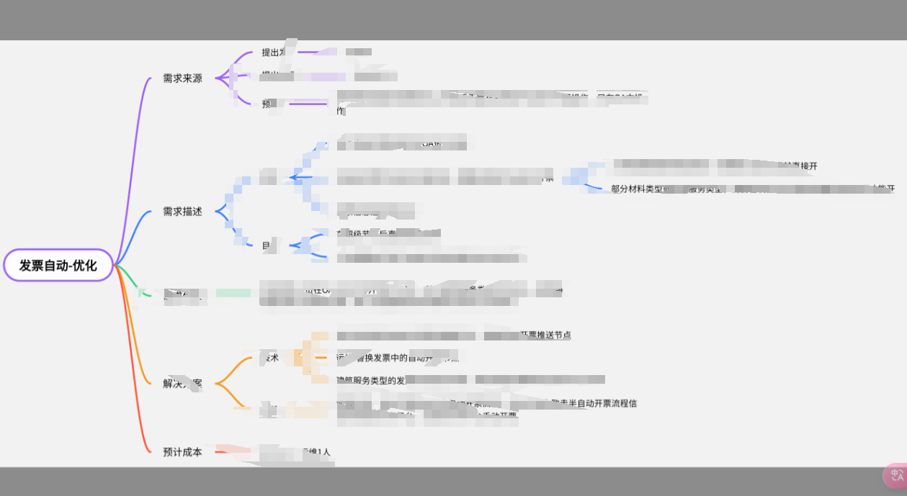
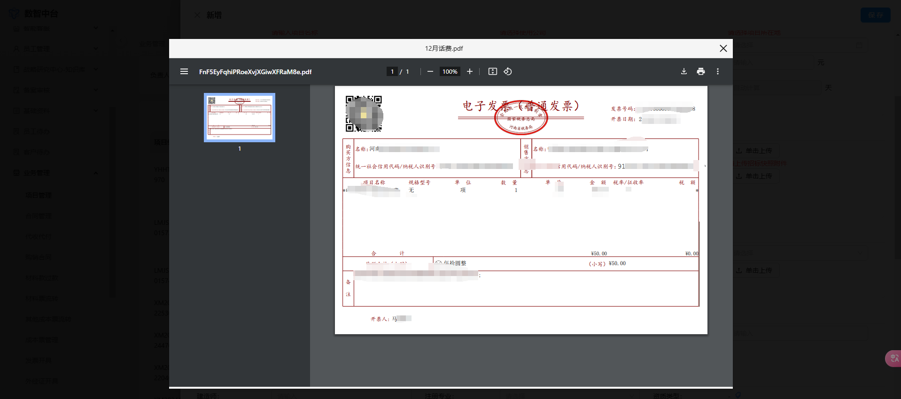
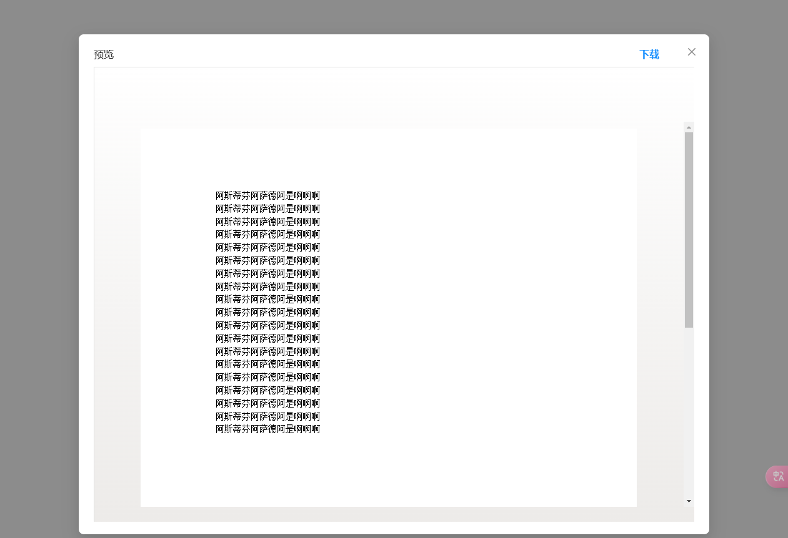

# React Doc Viewer Plus

A powerful document viewer component for React that supports various file formats including images, PDF, Office documents, OFD files and videos.

## Features

- 📷 Image preview support (jpg, jpeg, png, gif)
- 📄 PDF viewer
- 📊 Microsoft Office documents preview (doc, docx, xls, xlsx, ppt, pptx)
- 📑 OFD document preview
- 🎥 Video player support (mp4)
- 💾 Download support for office documents
- 🎨 Beautiful and responsive UI
- 🔧 Easy to integrate and customize

## Installation

```bash
npm install react-doc-viewer-plus
# or
yarn add react-doc-viewer-plus
```

## Usage

```tsx
import { DocViewerPlus } from 'react-doc-viewer-plus';

function App() {
  const [visible, setVisible] = useState(false);

  return (
    <DocViewerPlus
      previewFile={{
        fileUrl: 'https://example.com/sample.pdf',
        fileName: 'Sample Document.pdf'
      }}
      visibleViewerPlus={visible}
      onVisibleChange={() => setVisible(!visible)}
    />
  );
}
```

## Preview

### Image Preview


### PDF Preview


### Office Preview


### Video Preview


## Props

| Prop | Type | Description |
|------|------|-------------|
| previewFile | { fileUrl?: string; fileName?: string; } | The file to preview |
| response | { url?: string; } | Optional response object containing alternative URL |
| visibleViewerPlus | boolean | Controls the visibility of the viewer |
| onVisibleChange | () => void | Callback when visibility changes |

## Supported File Types

- Images: jpg, jpeg, png, gif
- Documents: pdf, doc, docx, xls, xlsx, ppt, pptx, ofd
- Video: mp4

## License

MIT
